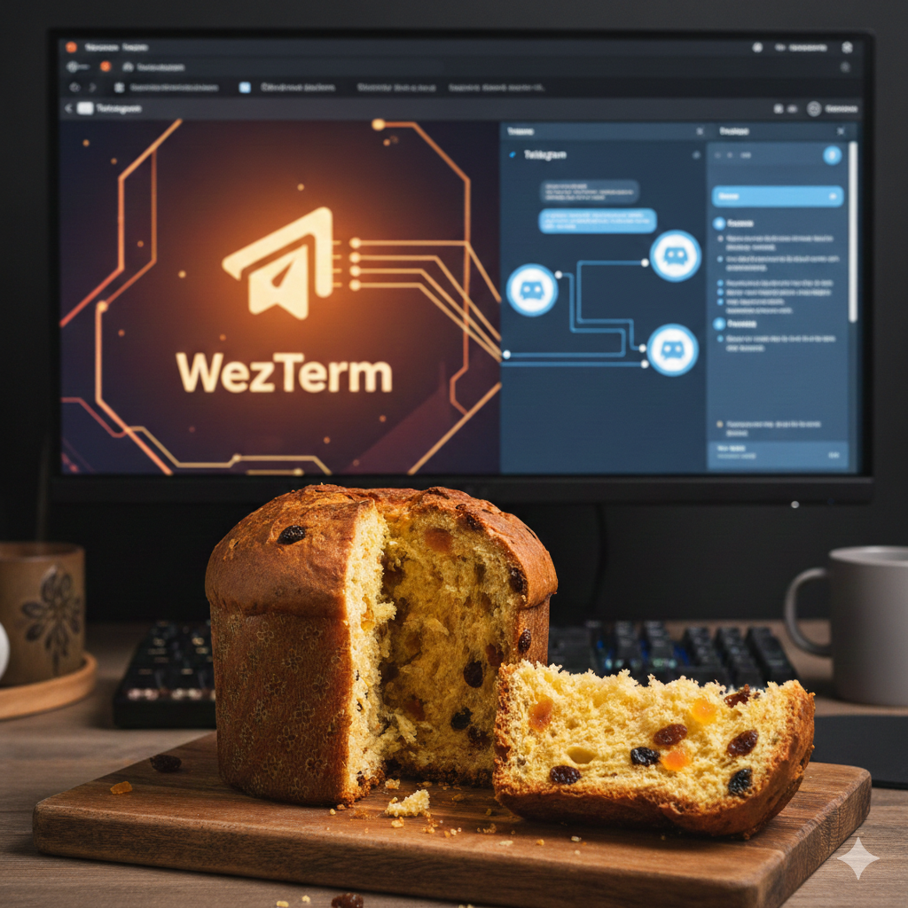

# Panetone

A lightweight bridge between [WezTerm](https://wezfurlong.org/wezterm/) and Telegram/Signal for juggling multiple AI coding agents (Claude Code, Codex, etc.) from your phone.

Each wezterm tab gets its own Telegram forum topic and/or Signal group chat. Multiple harnesses share the channel but post via their own identity. Replies route back to the right terminal pane.

<p align="center">
  
</p>

## Features

- **Forum topics per tab** — one topic per wezterm tab, named after the tab title
- **Multi-harness** — Claude and Codex post as separate bots in shared topics
- **Bidirectional** — read output in Telegram, send input back to the terminal
- **Collab mode** — `/collab` forwards responses between harnesses so they can talk to each other
- **Owner lock** — restrict input to your Telegram user ID
- **Session tailing** — reads `.claude` and `.codex` JSONL session files directly, no screen scraping
- **Signal support** — optionally mirror output to Signal groups via signal-cli (no extra Python deps)

## Telegram Setup

1. Create a Telegram group with [Topics enabled](https://telegram.org/blog/topics-in-groups-collectible-usernames#topics-in-groups)
2. Create bot(s) via [@BotFather](https://t.me/BotFather) and add them as group admins with "Manage Topics" permission
3. Create a `.env` file:

```
WEZ_TG_TOKEN_CLAUDE=your-claude-bot-token
WEZ_TG_TOKEN_CODEX=your-codex-bot-token    # optional
WEZ_TG_CHAT=-100xxxxxxxxxx
WEZ_TG_OWNER=your-telegram-user-id         # optional
```

4. Run:

```
uv run bridge.py
```

Requires [uv](https://docs.astral.sh/uv/) — dependencies are installed automatically via inline script metadata.

## Signal Setup (optional)

Signal has no bot API — panetone talks to [signal-cli](https://github.com/AsamK/signal-cli) over a UNIX socket (JSON-RPC 2.0). No extra Python dependencies needed.

1. Install Java 17+: `sudo dnf install java-17-openjdk`
2. Install [signal-cli](https://github.com/AsamK/signal-cli/releases) from GitHub releases
3. Register a number for the bot:
   ```
   signal-cli -a +BOT_NUMBER register
   signal-cli -a +BOT_NUMBER verify CODE
   ```
4. Start the daemon:
   ```
   signal-cli -a +BOT_NUMBER daemon --socket /tmp/signal-cli.sock
   ```
5. Add to your `.env`:
   ```
   WEZ_SIG_SOCKET=/tmp/signal-cli.sock
   WEZ_SIG_ACCOUNT=+1234567890
   WEZ_SIG_OWNER=+0987654321
   ```

All three `WEZ_SIG_*` variables must be set to enable Signal. When enabled, each wezterm tab gets a Signal group (named after the tab title) with your personal number invited. Agent output is prefixed with the harness display name (e.g. `Claude: ...`).

## Commands

All commands work in both Telegram topics and Signal groups:

| Command | Description |
|---------|-------------|
| `/list` | Show tracked panes and their harness |
| `/collab` | Toggle collab mode in the current topic/group |
| `/collab N` | Enable collab for N rounds |
| `/refresh` | Delete and recreate the current topic/group (clears all messages) |

## Example

See a [live collab session](https://wakamex.github.io/panetone/example/messages.html) where Claude and Codex built a repo together using Panetone — source at [wakamex/collab](https://github.com/wakamex/collab).

## Name

Claude came up with Paneetone when prompted to:

> *come up with a fun name for this bot*

> **panetone** — "pane" + "tone" (notification), sounds like panettone (the bread), and you're slicing up panes to serve them on Telegram.
