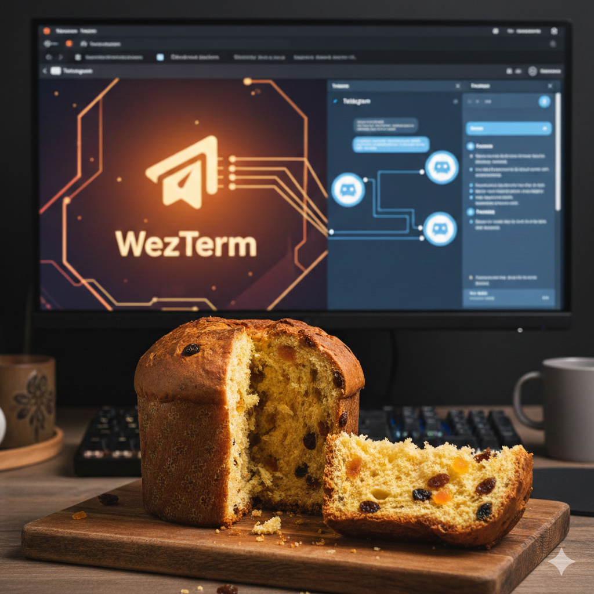

# Panetone

A lightweight bridge between [WezTerm](https://wezfurlong.org/wezterm/) and Telegram/Signal for juggling multiple AI coding agents (Claude Code, Codex, etc.) from your phone.

Each wezterm tab gets its own Telegram forum topic and/or Signal group chat. Multiple harnesses share the channel but post via their own identity. Replies route back to the right terminal pane.

<p align="center">
  
</p>

## Features

- **Forum topics per tab** — one topic per wezterm tab, named after the tab title
- **Multi-harness** — Claude and Codex post as separate bots in shared topics
- **Bidirectional** — read output in Telegram, send input back to the terminal
- **Collab mode** — `/collab` forwards responses between harnesses so they can talk to each other
- **Owner lock** — restrict input to your Telegram user ID
- **Session tailing** — reads `.claude` and `.codex` JSONL session files directly, no screen scraping
- **Signal support** — optionally mirror output to Signal groups via signal-cli (no extra Python deps)

## Telegram Setup

1. Create a Telegram group with [Topics enabled](https://telegram.org/blog/topics-in-groups-collectible-usernames#topics-in-groups)
2. Create bot(s) via [@BotFather](https://t.me/BotFather) and add them as group admins with "Manage Topics" permission
3. Create a `.env` file:

```
WEZ_TG_TOKEN_CLAUDE=your-claude-bot-token
WEZ_TG_TOKEN_CODEX=your-codex-bot-token    # optional
WEZ_TG_CHAT=-100xxxxxxxxxx
WEZ_TG_OWNER=your-telegram-user-id         # optional
```

4. Run:

```
uv --no-config run --locked --script bridge.py
```

Requires [uv](https://docs.astral.sh/uv/). Runtime dependencies are resolved
from the committed `bridge.py.lock`; refresh it deliberately with
`uv --no-config lock --script bridge.py`.

Production does not watch source files or reload itself. Develop in a separate
Git worktree, run the test suite there, stop the service, promote the tested
commit into `/code/msger`, and start the service once. The production unit is
tracked at `deploy/panetone.service` and installed under `/etc/systemd/system/`.
It uses the system-labeled `/usr/local/bin/uv` executable and runs as `mihai`.
Promote it with:

```sh
sudo /bin/bash /code/msger/deploy/install-system-service.sh
```

The installer checks the committed lock before stopping the current service and
restores the temporary user service automatically if system-service promotion
fails.

Panetone probes Wakterm durable-return support once during startup. When the
installed Wakterm lacks that capability, ordinary one-way sends remain enabled
but `--return-final` fails before Telegram or prompt delivery. A compatible
Wakterm installation takes effect after a deliberate Panetone restart.

## Signal Setup (optional)

Signal has no bot API — panetone talks to [signal-cli](https://github.com/AsamK/signal-cli) over a UNIX socket (JSON-RPC 2.0). No extra Python dependencies needed.

1. Install Java 17+: `sudo dnf install java-17-openjdk`
2. Install [signal-cli](https://github.com/AsamK/signal-cli/releases) from GitHub releases
3. Register a number for the bot:
   ```
   signal-cli -a +BOT_NUMBER register
   signal-cli -a +BOT_NUMBER verify CODE
   ```
4. Start the daemon:
   ```
   signal-cli -a +BOT_NUMBER daemon --socket /tmp/signal-cli.sock
   ```
5. Add to your `.env`:
   ```
   WEZ_SIG_SOCKET=/tmp/signal-cli.sock
   WEZ_SIG_ACCOUNT=+1234567890
   WEZ_SIG_OWNER=+0987654321
   ```

All three `WEZ_SIG_*` variables must be set to enable Signal. When enabled, each wezterm tab gets a Signal group (named after the tab title) with your personal number invited. Agent output is prefixed with the harness display name (e.g. `Claude: ...`).

## Commands

All commands work in both Telegram topics and Signal groups:

| Command | Description |
|---------|-------------|
| `/list` | Show tracked panes and their harness |
| `/collab` | Toggle collab mode in the current topic/group |
| `/collab N` | Enable collab for N rounds |
| `/refresh` | Delete and recreate the current topic/group (clears all messages) |

## Local control interface

Install the local CLI:

```sh
install -m 0755 ./panetone ~/.local/bin/panetone
```

Send a message between live Panetone routes:

```sh
panetone send --from ufopedia --to wakterm "Investigate the observer bug"
```

`SOURCE` and `TARGET` are exact, case-insensitive Wakterm tab titles currently
registered by the running bridge. Panetone posts an audit message in the target
Telegram topic, switches that target's output route to Telegram, submits the
message through `wakterm cli agent send`, and prints a structured JSON receipt.

Ordinary sends remain one-way. Add `--return-final` for durable asynchronous
delegation:

```sh
panetone send --return-final --from ufopedia --to zola \
  "Finish the migration review"
```

Panetone registers the source agent and Telegram route before submitting the
prompt, then exits with `reply_pending: true`. Wakterm correlates the prompt to
its exact target session and provider turn. When that turn reaches a terminal
state, Panetone resumes from Wakterm's durable event stream and sends one
correlated callback to the source agent and source Telegram topic. Neither the
calling agent nor Panetone parses harness session files for this correlation.

Every request has a UUID idempotency key. The CLI generates one by default and
returns it in the response. Use `--id UUID` when retrying after a lost response.
The same ID and content return the stored receipt without redelivery. Different
content with the same ID returns `idempotency_conflict` during the 30-day
completed-request retention window. Pending and indeterminate IDs do not expire.
Panetone never retries a request left uncertain across a process failure.

The Panetone control socket defaults to
`$XDG_RUNTIME_DIR/panetone/control.sock`. It is separate from the Wakterm mux
socket. Set `PANETONE_CONTROL_SOCKET` for both the bridge and CLI to override it.
See [the control protocol](docs/control-protocol.md) for framing, state, failure,
and permission details.

## Example

See a [live collab session](https://wakamex.github.io/panetone/example/messages.html) where Claude and Codex built a repo together using Panetone — source at [wakamex/collab](https://github.com/wakamex/collab).

## Name

Claude came up with Paneetone when prompted to:

> *come up with a fun name for this bot*

> **panetone** — "pane" + "tone" (notification), sounds like panettone (the bread), and you're slicing up panes to serve them on Telegram.
